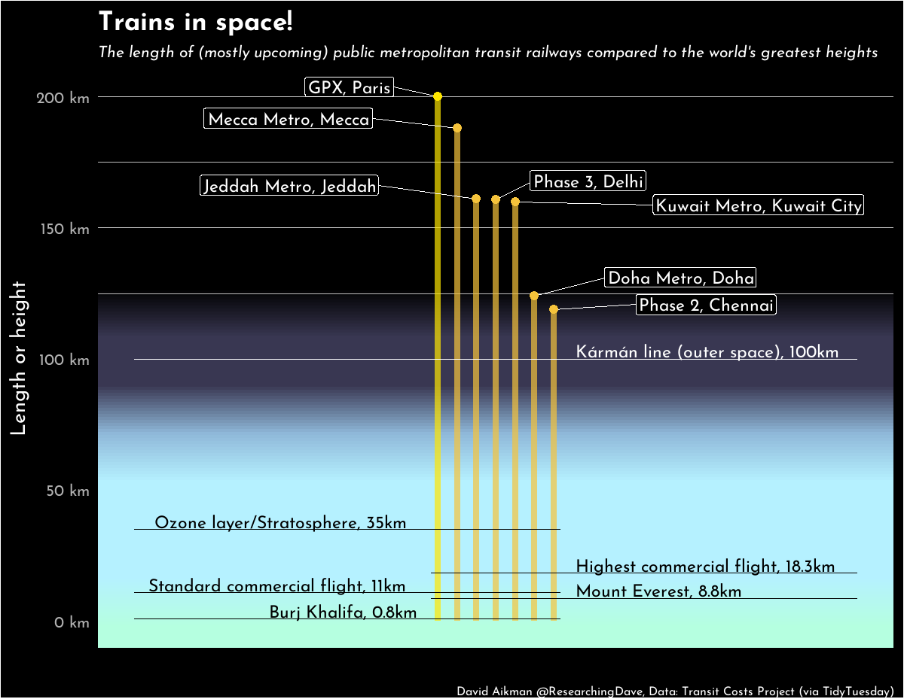

# Trains in Space
TidyTuesday 2021, Week 2: [Urban Rail data](https://github.com/rfordatascience/tidytuesday/blob/master/data/2021/2021-01-05/readme.md)

I noticed a lot of the train routes were pretty long, so decided to see how far they would go if they were vertical. Turns out a few of them would go into space!

